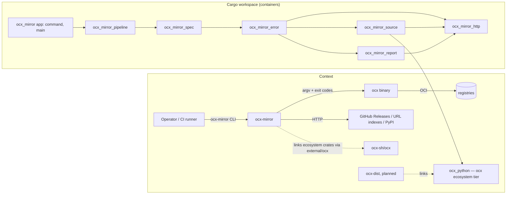

# ADR: Bazel build, crate split and `ocx_python` promotion (umbrella)

## Metadata

**Status:** Proposed
**Date:** 2026-09-22
**Deciders:** Michael Herwig (owner, ratified the dossier); umbrella `/hex-architect high` (this record); orchestrator rulings A1–A10 after review
**GitHub Issue:** N/A (goal run `.agents/goal/bazel-crate-split.md`)
**Related Design Spec:** dossier `.agents/discussions/bazel-crate-split.md` (ratified 2026-09-22) — this ADR closes its five `## Open questions`
**Classification:** blast radius **cross-area + external contract** (every `src/` module moves; a new ecosystem-tier crate `ocx_python` is proposed to `ocx-sh/ocx`, which `ocx-dist` may link). Reversibility **one-way (medium)**: once landed on ocx `main` the crate is permanent history and a stability promise to every satellite — the landing itself is an owner action (C6); the mirror crate layout and names are two-way but expensive (every import path, BUILD file, the crate map); Bazel is two-way (delete the files; CI tests never depend on it unless the C11 bar passes).
**Stack Alignment:**
- [x] Rust 2024 + Tokio, `subsystem-mirror.md` conventions; Bazel 9.2.0 + rules_rust 0.74.0 copied from ocx (no dependency category ocx does not already carry)
**Domain Tags:** ci | source | spec | pipeline | docs
**Supersedes:** N/A — amends `adr_ocx_python_crate.md` (its "extract when ocx-dist starts" trigger is exercised early, by owner direction)
**Superseded By:** N/A

## Context

The dossier orders four phases: **0** AI config → **1** crate split → **2** promote
`ocx_python` into ocx → **3** Bazel for the Linux build/test loop, and leaves Q1–Q5 open.
Facts this record rests on, each re-verified by grep or read:

- `src/` is one 75,452-line crate; `command`, `pipeline`, `spec`, `source`, `filter` form one
  strongly connected cluster through four back-edges (`research_mirror_crate_graph.md` §2).
  `error` has zero real outgoing edges.
- `crates/ocx_python` (3,976 lines) has no mirror leakage; `src/source/pylock.rs` is a
  mirror adapter (`VersionInfo`, `tokio::fs`, spec-dir join, `MirrorError` classification).
- `external/ocx` is pinned at `191b9324`, before ocx's Bazel adoption (`MODULE.bazel` first
  at `63c1b71f`); ocx `origin/main` is 14 commits past the pin and Bazel-era.
- rules_rust 0.74.0 (cached module on this host) renders every `source = path` crate through
  `local_crate_mirror`: `cp -r` of the crate directory into a repository, then
  `cargo-bazel render` writes `BUILD.bazel` **into that repository**
  (`crate_universe/extensions.bzl:786-801`, `private/local_crate_mirror.bzl:17-25`). ocx
  separately measured crate_universe writing `BUILD.bazel` into its `[patch]` submodules'
  working trees (DX-24) and gitignores `Cargo.bazel.lock.json` because it records the
  generating machine's output base (DX-23, ocx `.gitignore:143-145`).
- ocx's Bazel lessons (`research_bazel_crate_split_lessons.md` §Key findings 1–10) and its
  lane-swap history: the ratified R2 bar measured **NO-GO** (warm Bazel saved 66.6 s against
  a 240 s bar, `measurement_bazel_r2.md`); the swap landed anyway by **owner direction**
  (`decision_bazel_adoption.md`, Reading 4) with R2 re-specified afterwards, on a lane that
  reads a **remote cache** (`bazel-cache.ocx.sh`). This programme has no remote cache.
- ocx `task satellite:verify` is a **deny-list** (`OPERATIONS_CRATES`, `satellite.taskfile.yml:26`)
  and floors the mirror pathspecs `src/*.rs`, `crates/*.rs`, `tests/*.rs`, `Cargo.toml`,
  `*/Cargo.toml` at ≥1 file each (`:182-193`).
- ocx `main`: squash and merge-commit disabled, rebase-merge replays commits unsigned,
  rulesets require PR + signatures. The owner granted **squash only**; no ruleset bypass
  is pre-authorized for this run.

## Decision Drivers

1. **Behaviour preservation** — every argv, exit code, stdout byte and error message of the
   v0.6.2 binary survives; the frozen v0.6.2 `test/` tree is the oracle.
2. **One implementation, one copy** — no duplicated third-party crates across a Bazel hub
   boundary (the reqwest-major-split failure class, `CLAUDE.md` § Dependency model); one
   `[patch.crates-io]` source of truth.
3. **ocx consistency** — copy ocx's solved patterns before inventing.
4. **Cache precision** — a test lives in the lowest crate that owns its code
   (`adr_test_speed_tiers.md` insight 3).
5. **Promotion readiness** (ratified requirement) — generic crates carry no mirror error or
   spec types.
6. **Signed linear ocx trunk**, no outward action beyond what the owner granted, zero edits
   to the sibling `../ocx`.
7. **RAM envelope** — WSL host, 31 GB shared with rust-analyzer, cargo and ocx's own Bazel.

## Industry Context & Research

**Research artifacts:** [research_bazel_crate_split_lessons.md](./research_bazel_crate_split_lessons.md),
[research_bazel_cross_module_ocx.md](./research_bazel_cross_module_ocx.md),
[research_mirror_crate_graph.md](./research_mirror_crate_graph.md).

- **Kernel/app splits** (dossier § Decisions): *rattler* extracted its conda kernel only once
  a third consumer existed; *uv* splits into dozens of internal crates and never stabilises
  them (why `ocx_python` pins one uv git rev); *gitoxide* ships `gix-*` plumbing under
  stability tiers behind a `gix` façade — the shape of ocx's internal/ecosystem/interface
  tiers. Default rule taken: promote on a **named second caller** with a real call site.
  This programme's promotion is an owner-directed exception to that default (Q3).
- **Cross-module Bazel Rust:** no cross-hub crate coalescing in mainline rules_rust
  (hermeticbuild/rules_rs#255 is a fork); a non-root `crate.from_cargo` needs
  `dev_dependency = True` and is then invisible to the root (rules_rust#1738/#2879);
  `git_override` and `register_toolchains` are root-only.
- **cargo→Bazel evaluations** are mostly negative on wall-clock (micromegas#1610; ocx R2).
  **Key insight:** the win is the cached local/agent loop; CI moves only on a measured bar.

---

## Q1 — How does the mirror's Bazel graph consume ocx crates?

| Criterion (weight) | O1 one `@crates` hub; crate_universe renders `external/ocx/crates/*` as path crates | O2 `bazel_dep(ocx)` + `local_path_override("external/ocx")` | O3 mirror-owned BUILD overlays for the ocx crates |
|---|---|---|---|
| One copy of every shared crate (30) | 5 | 1 — two hubs, two `reqwest`/`tokio`/`oci-client` | 5 |
| Works at the pin with no upstream change (20) | 4 — spike-gated | 1 — ocx's hub invisible to a root, `git_override`/`register_toolchains` inert | 5 |
| Cost per ocx bump (20) | 4 — nothing to edit | 2 | 1 — nine dep lists re-derived per bump |
| ocx consistency (15) | 5 — ocx relies on the same rendering for its forks | 3 | 3 |
| Reversibility (15) | 4 | 3 | 4 |
| **Weighted /500** | **445** | 180 | 375 |

Steelman O2: Bazel's native answer — reuse ocx-authored, ocx-tested build graphs and write
none. It fails on mechanism: the four blockers in `research_bazel_cross_module_ocx.md` §F are
independent and each is fatal alone. Steelman O3: deterministic and immune to whatever writes
into submodule trees (DX-24); it loses only on per-bump maintenance, so it is a ranked
fallback, not a rejected idea.

**Decision: O1.** `crate.from_cargo(name = "crates", cargo_lockfile = "//:Cargo.lock",
lockfile = "//:Cargo.bazel.lock.json", manifests = ["//:Cargo.toml"])` — root manifest only,
exactly ocx's call; the splice discovers `members = ["crates/*"]`. ocx's committed
`external/ocx/crates/*/BUILD.bazel` are **never loaded** (outside `//...`, no label names
them); ocx crates reach the graph only as `local_crate_mirror` copies. `Cargo.bazel.lock.json`
is gitignored and regenerated by `task bazel:bootstrap`. MODULE pins copy ocx: Bazel 9.2.0,
rules_rust 0.74.0, rules_shell 0.8.0, buildifier_prebuilt 8.5.1.4, rules_ocx 0.4.0 via the
same `git_override` commit `9ced5ffb…`, `rust.toolchain(edition = "2024", versions =
["1.95.0"])` (= `rust-toolchain.toml`).

**Spike S** — run twice: as a **throwaway at the start of phase 1** (isolated worktree
`.agents/worktrees/spike-bazel` on the freshly bumped pointer, minimal `MODULE.bazel` +
`.bazelrc` + empty root `BUILD.bazel`, nothing committed, verdict in the ledger) **before the
promotion PR opens**; and again as the first step of phase 3 on the real tree.

| # | Assertion | Acceptance |
|---|---|---|
| S-a | Every linked ocx crate is rendered and compiles | `bazel build @crates//:ocx_config @crates//:ocx_console @crates//:ocx_exit @crates//:ocx_index @crates//:ocx_oci @crates//:ocx_package @crates//:ocx_sign @crates//:ocx_util` exit 0 (+ `@crates//:ocx_python` in phase 3) |
| S-b | Nothing is written into any submodule tree | on a **fresh clone** (`git clone --recurse-submodules`), **before any `info/exclude` step**, after S-a: `git -C <clone>/external/ocx status --porcelain --untracked-files=all --ignored=matching` is empty, and the same in each nested `external/ocx/external/*` |
| S-c | The patch table binds under Bazel | `Cargo.bazel.lock.json` entries `oci-client *`, `docker_credential *`, `sigstore *` carry `repository.Path` whose path ends in the fork directory name (exact form recorded, then frozen into `bazel:patch:check`) |
| S-d | Binary parity (phase 3 only) | `bazel build -c opt //:ocx-mirror` exit 0; `--version` byte-equal to the cargo build's |

S-b decides the `info/exclude` step of `bazel:bootstrap`: kept **only if** S-b shows DX-24
writes (then S-b's acceptance becomes "only untracked `BUILD.bazel` files, no modified tracked
file"); otherwise dropped. Failure → phase-scoped `/hex-architect` amendment, logged. Ranked
fallbacks: **FB1** `crate.annotation` on the failing crate (`compile_data`,
`additive_build_file_content`) — for e.g. an `include_str!` reaching outside the crate
directory; **FB2** mirror-generated, uncommitted overlay repositories — a mirror repository
rule (`bazel/ocx_crates.bzl`, `use_repo_rule`) that symlinks each ocx crate's `src/` +
`Cargo.toml` into its own repo and writes a BUILD generated by `bazel:bootstrap` from
`cargo metadata`, wired with `crate.annotation(crate = "<name>", override_target_lib =
"@ocx_src_<name>//:<name>")` — never writes into the submodule, so it also cures S-b;
**FB3** Q1-O3 with a drift gate against `cargo metadata`. S-c failing is stop-and-amend
(ocx proves the same forks bind).

## Q2 — How is `[patch.crates-io]` into `external/ocx/external/*` expressed?

| Criterion (weight) | O1 implicit: the Cargo patch table, read by the splicer's `cargo metadata` (ocx) | O2 restate in MODULE.bazel (`crate.spec(path=…)` / annotations) | O3 `crates_vendor` committed tree |
|---|---|---|---|
| Single source of truth (30) | 5 | 2 — second copy of three pins | 3 |
| Silent-unpatch protection (30) | 4 — needs the assertion below | 3 — `crate.spec(path)` cannot carry `version` | 2 — rules_rust#3732 alias bug is vendor-mode |
| ocx consistency (20) | 5 | 1 | 1 |
| Effort (20) | 5 | 2 | 1 |
| **Weighted /500** | **470** | 210 | 190 |

Steelman O2: an explicit Bazel-side declaration survives deletion of the Cargo table.
Answered by an assertion that fails in exactly that case without a second copy.

**Decision: O1, copy ocx.** Nothing in `MODULE.bazel` names the forks. New gate
`task bazel:patch:check`: after bootstrap, select `Cargo.bazel.lock.json` entries whose key
starts with `oci-client `, `docker_credential `, `sigstore `; exactly one each; each
`repository` is `Path` and its path ends with `rust-oci-client`, `docker_credential`,
`sigstore-rs`. CI's `cargo tree -i` step stays.

## Q3 — Name, tier and scope of the promoted Python crate

| Criterion (weight) | O1 `ocx_python`, ecosystem; whole crate + one `Option` lock query | O2 whole crate + entire `pylock.rs` (dossier literal) | O3 `ocx_python`, interface tier | O4 new name (`ocx_pylock`…), ecosystem |
|---|---|---|---|---|
| Usable by ocx-dist without mirror concepts (30) | 5 | 3 — drags `VersionInfo`, spec-dir join, exit classification | 5 | 5 |
| Behaviour preservation (25) | 5 — message and classification stay in the mirror | 3 | 5 | 5 |
| Tier fit (20) | 5 — has behaviour (repack, compose, I/O) | 2 | 1 — interface = value/contract crates (`ocx_exit`); uv git pins cannot back it | 5 |
| Churn (15) | 4 | 2 | 4 | 2 |
| Reversibility (10) | 4 | 3 | 2 | 3 |
| **Weighted /500** | **475** | 265 | 375 | 435 |

**Decision: O1.** Crate `ocx_python`, **ecosystem tier**. **Trigger: owner-directed** — the
owner names `ocx-dist` (planned, no repository yet) as the second caller;
`adr_ocx_python_crate.md:98` had set "extract when ocx-dist starts". This promotion is an
explicit exception, and `crate-placement.md` must not cite it as precedent for promoting
without a live caller. Moves: all of `crates/ocx_python` (9 modules, tests,
`tests/fixtures/` incl. the 9 `.whl`, `pylock/`, `generate.py`, `README.md`) plus one pure
query. The `anyhow` message, the locked-package list and the exit classification stay in the
mirror adapter. Contract C5.

## Q4 — Mirror crate boundaries and names

| Criterion (weight) | O1 move types down + local error enums, 8 crates | O2 trait inversion | O3 coarse: leaves out, one core holds spec+pipeline+command | O4 5 crates: test_support, core (error+http+auth+report+source+resolver, keeps `MirrorError`), spec, pipeline, root |
|---|---|---|---|---|
| Acyclic, compiler-enforced boundaries (25) | 5 | 5 | 4 | 4 |
| Cache/test precision (25) | 5 | 4 | 1 — any core edit re-runs ~90 % of tests | 4 — an `http` edit rebuilds everything in both O1 and O4; only an `error` edit keeps the generic crates cached, and only in O1 |
| Behaviour-preservation risk (20) | 4 | 3 | 5 | 5 — no E1–E4 |
| Churn (15) | 2 | 1 | 5 | 3 |
| Promotion readiness (15) | 5 | 4 | 4 | 1 — generic code welded to `MirrorError` |
| **Weighted /500** | **435** | 360 | 360 | 360 |

O4 is the honest challenger: cheaper (no local error enums, no From/Display-identity work)
and nearly as precise. **It is rejected because it violates the ratified requirement**
"generic crates shaped for promotion — no dependency on mirror spec/error types", not on
points. The E1–E4 cost that buys compliance is bounded: characterization tests written
before the move pin every message and exit code. A naive 1:1 module→crate mapping does not
compile (four back-edges) and is not an option.

**Decision: O1**, contracts C1–C4. The dossier's candidate "ocx subprocess boundary" crate
(`pipeline/{ocx_cli,push}.rs`) is not split out (D4).

## Q5 — The measured bar for the CI lane swap

| Criterion (weight) | O1 whole-job ratio + absolute floor, warm and cold, correctness conditions | O2 ocx R2 shape: ≥240 s saving on the `Test` step | O3 no bar, owner go by fiat |
|---|---|---|---|
| Measures what the swap changes (30) | 5 — Bazel replaces Build **and** Test | 2 — step-scoped | 1 |
| Reachable iff caching works (25) | 4 | 2 — Test step ≈251 s: Bazel incl. restore must take ≤11 s | 5 |
| Pre-declared, falsifiable (25) | 5 | 5 | 1 — forbidden by the dossier |
| Measuring cost (20) | 3 — 20+ runs | 4 | 5 |
| **Weighted /500** | **435** | 315 | 280 |

**Decision: O1**, the bar in C11. Build + Test are ≈458 s of the longest measured
`Smoke (Linux)` run, so a 25 % job cut needs Bazel to remove ~38 % of its replaceable surface
warm — reachable if the cache works, unreachable if not. The 120 s floor keeps a noise-sized
ratio win from passing. **Expected verdict: NO-GO** — ocx's lane rests on a remote cache this
programme does not have, and ocx's own disk-only reading missed its bar. The dossier requires
recorded numbers, so the measurement runs anyway.

---

## Component contracts

### C1 — Crate map (phase 1)

Root `Cargo.toml` keeps `[package] name = "ocx_mirror"`, `[lib] path = "src/lib.rs"`,
`[[bin]] name = "ocx-mirror"`; adds `[workspace] members = ["crates/*"]`, keeps `exclude =
["external/ocx"]`; `[workspace.package]` carries version, edition 2024, license, repository,
homepage, `publish = false` (members inherit); `[workspace.dependencies]` holds every
copy-exactly row once (members use `.workspace = true`); `[workspace.lints.rust] warnings =
"deny"`, every member `[lints] workspace = true`; `[patch.crates-io]` stays in the root. The
root package stays at the repository root because ocx's satellite scan floors `src/*.rs` at
≥1 file.

| Crate (`crates/<name>`) | Kind | Contents (moved from) | Mirror deps allowed |
|---|---|---|---|
| `ocx_mirror_test_support` | dev-only | `src/test_support.rs` (`OCX_ENV_LOCK`, `EnvRestore`) made `pub` | none |
| `ocx_mirror_http` | generic | `http.rs`, `auth.rs` (+`auth/tests.rs`), `jitter` from `pipeline/ocx_cli/push.rs:196` (+ its test) | none |
| `ocx_mirror_report` | generic | `junit.rs`, `run_summary.rs`, `discord.rs` | http |
| `ocx_mirror_source` | generic | `source.rs` + `source/*` (github_release, url_index, pypi, pylock adapter, generator), `resolver.rs` + `resolver/*`, `GeneratorConfig` + `UrlIndexVersion` from `spec/source.rs:379-400` | http, ocx_python* |
| `ocx_mirror_error` | mirror | `error.rs` (`MirrorError`, `kind_exit_code`, `sign_exit_code`, `tls_exit_code`), all `From<local> for MirrorError`, `pylock::classify_error` and `pypi::classify_error` (moved out of source) | http, report, source, ocx_python* |
| `ocx_mirror_spec` | mirror | `spec.rs` + `spec/*`, `filter.rs`, `normalizer.rs`, `version_platform_map.rs`, `annotations.rs`; grammar moved **down** from pipeline: `registry_sync/glob.rs` → `src/glob.rs`, `registry_sync/destination.rs` → `src/destination.rs`, `dist_sync/layout.rs` → `src/layout.rs`, `catalog::index_host` → `ocx_mirror_spec::registry::index_host` | error, source, http, ocx_python* |
| `ocx_mirror_pipeline` | mirror | `pipeline.rs` + `pipeline/*` incl. `ocx_cli/*`; `OutputFormat` (`command/package/options.rs`) and `RegistrySyncOptions` (`command/registry/options.rs`) moved **down** | spec, source, report, http, error, ocx_python* |
| `ocx_mirror` (root) | app | `command.rs` + `command/*`, `main.rs`, `tracing_init.rs`, `lib.rs` façade | all of the above |

\* `ocx_python` is a workspace member (`crates/ocx_python`, map row `ocx_python = []`) in
phase 1 and an `external/ocx` path crate from phase 2 on (row removed). Moved items keep
their old paths through re-exports: `spec` re-exports `GeneratorConfig`/`UrlIndexVersion`;
pipeline re-exports `registry_sync::{glob, destination}`, `dist_sync::layout` and
`registry_sync::catalog::index_host`; `command` re-exports the two option types.

**Allowed ocx crates:** `ocx_config, ocx_console, ocx_exit, ocx_index, ocx_oci,
ocx_package, ocx_sign, ocx_util` (+ `ocx_python` from phase 2) — the satellite linking rule,
enforced locally.

**Enforcement** (mirror copy of ocx's `crate_map.toml` + `deps_direction`):
`crates/crate_map.toml` with `[allowed]` (the table above, root key `ocx_mirror`),
`[ocx] allowed = [...]`, `[dev] allowed_everywhere = ["ocx_mirror_test_support"]`; root test
`tests/workspace_structure.rs` reads `cargo metadata --format-version 1 --locked` and fails
on: a mirror edge not in `[allowed]` (dev edges judged against `[dev]`); an `ocx_*` dependency
outside `[ocx]`; a member without a row or a row without a member; a member without `[lints]
workspace = true`; a mirror-owned member whose name does not start with `ocx_mirror` (the
A9 log-filter invariant). Each clause needs a red-proof on a planted violation.

**Rules:** prefix `ocx_mirror_*`; `pub(crate)` widens to `pub` only for items crossing a
crate boundary; no cross-crate `pub use *`; new items follow the module-placement convention
(one error type per module, beside its producer). In the pipeline crate `ocx_cli` is reached
only as `crate::ocx_cli::` or `super::…`, never `ocx_cli::` at a path root (ocx's satellite
scan would read it as the forbidden crate). `jsonschema` (28 `feature = "jsonschema"` sites,
9 files): `ocx_mirror_source/jsonschema = ["dep:schemars"]`, `ocx_mirror_spec/jsonschema =
["dep:schemars", "ocx_mirror_source/jsonschema"]`, root `jsonschema = ["dep:schemars",
"ocx_mirror_spec/jsonschema", "ocx_mirror_source/jsonschema"]`.

### C2 — Façade, path and output invariants

- Every path public today still resolves; additions are allowed. `src/lib.rs`:
  `pub use ocx_mirror_error as error;`, `pub use ocx_mirror_spec as spec;`,
  `pub use command::Command;`, `pub use ocx_mirror_http::install_extra_roots;`.
  `tests/spec_validation.rs` and `tests/registry_spec_validation.rs` compile unchanged.
- `CARGO_PKG_VERSION` is the workspace version everywhere, so `github_release.rs:20`'s
  `User-Agent` stays byte-identical (characterization test).
- `tests/`, `tests/fixtures/`, `tests/golden/` stay at the root; moved tests use
  `concat!(env!("CARGO_MANIFEST_DIR"), "/../../tests/fixtures/…")`. The wheel used by
  `pipeline/python_prepare.rs:464-467` is copied to
  `tests/fixtures/wheels/console_pkg-1.0.0-py3-none-any.whl`.
- **Log targets change** (D7): `ocx_mirror::pipeline::x` becomes `ocx_mirror_pipeline::x`.
  Invariant: the documented recipe `RUST_LOG=info,ocx_mirror=debug`
  (`docs/reference/cli.md:12`) still enables debug output of every mirror crate — `EnvFilter`
  matches a target by string prefix. Test: build that filter, emit `debug!` under each
  member crate's name as target, assert every event is captured.
- `ocx-mirror schema {url-index,dist,plan}` (jsonschema build) output is byte-compared
  against a build of the branch base commit (pre-split), not v0.6.2.

### C3 — Error boundary (generic crates)

- **E1** `ocx_mirror_http` (`http`, `auth`), `ocx_mirror_report` and, in
  `ocx_mirror_source`, `github_release::{client, api_client}` return local `thiserror` enums;
  no generic crate names `MirrorError` or a `spec` type.
- **E2** `impl From<Local> for MirrorError` lives in `ocx_mirror_error` and yields the
  **same variant and inner message** the replaced code constructed.
- **E3** Every local error's `Display` is byte-identical to the `Display` of the
  `MirrorError` it replaces — these errors also travel through `anyhow` chains
  (`pypi.rs:110,119`, `url_index.rs:153`) where `{err:#}` renders them. Per variant:
  `MirrorError::from(e).to_string() == e.to_string()`, exit code unchanged. Wording cleanup
  is promotion-time work.
- **E4** Sites: `http.rs:127-175` (client build → `ExecutionFailed`; `read_capped` →
  `SourceError`), `auth.rs:111-147` (`SpecUsageError`), `discord.rs:156-239`
  (`WebhookUnavailable`/`WebhookPermissionDenied`), `junit.rs:86-252` (`JunitParseError`),
  `github_release.rs:151-201` (`ExecutionFailed`). Characterization tests are committed
  **before** the move, asserting message and exit code at the first caller that observes a
  `MirrorError`; afterwards they pass with import-path edits only.
- **E5** `anyhow` stays where it is (`source/*` API); `thiserror` conversion is promotion debt.

### C4 — Test relocation and the cargo/Bazel test split

- Unit tests move with their module (`#[path = "<mod>/tests.rs"]` convention holds). A test
  reaching upward moves to the lowest crate seeing both ends (e.g.
  `spec/metadata_config.rs:377-379` uses `pipeline::package` → pipeline crate).
- Cross-crate self-scans move to one root test `tests/source_scan.rs`: the extra-roots scan
  (`http.rs:378-440`, now walking `src/` and every `crates/*/src/`) and
  `registry_sync/tests.rs:685-703`. Same-crate `include_str!("../x.rs")` scans stay.
- `OCX_ENV_LOCK` lives in `ocx_mirror_test_support`. One lock per test process suffices:
  environment is per-process; cargo test runs binaries one after another, nextest and Bazel
  give each test/target its own process; inside one binary Cargo links a single copy of the
  support crate, so every env-mutating test there serialises on one static.
- **Count gate (phase 1):** `cargo nextest list --workspace --release --locked` case count
  after = before + added characterization tests; both name lists attached to the ledger.
- **Bazel/cargo split (phase 3, ocx `crates/ocx_test_support/BUILD.bazel:112-155` shape):**
  cases needing their own process, cwd, `cargo metadata` or a cross-crate source walk
  (`workspace_structure`, `source_scan`, the `CWD_LOCK` test in
  `pipeline/registry_sync/cache/tests.rs`, and any env mutator that proves flaky) are
  `--skip`ped with `--exact` on their `rust_test`; targets holding env mutators run
  `--test-threads=1`. Each skipped name is an `[[excluded]]` row (name, reason) in
  `crates/TEST_TARGET_MAP.toml`; the list only shrinks. `task rust:test:bazel-excluded` runs
  exactly those rows through `cargo nextest` (filter generated from the rows) inside
  `task verify`. **Coverage gate** `bazel:test:coverage`: the Bazel-executed case set ⊇
  `cargo nextest list` minus the `[[excluded]]` rows; red on any gap.

### C5 — `ocx_python` promotion (phase 2)

**ocx PR** (authored in `external/ocx`, branch from ocx `origin/main`):

| Path | Change |
|---|---|
| `crates/ocx_python/**` | the mirror crate verbatim (SPDX headers kept); manifest `version/edition/rust-version/license.workspace = true`, `publish = false`, `[lints] workspace = true`; fixes only what ocx's workspace lints demand |
| `crates/ocx_python/src/lock.rs` | `Pylock::find_package` (below) + new tests `find_package_exact`, `find_package_pep503`, `find_package_missing` |
| `crates/ocx_python/BUILD.bazel` | hand-written, `crates/ocx_index/BUILD.bazel` shape: `rust_library` (`all_crate_deps(normal)` + `//crates/ocx_oci`, `//crates/ocx_package`, `rustc_env CARGO_MANIFEST_DIR = "crates/ocx_python"`, `compile_data` glob) and `rust_test` with `data = glob(["tests/fixtures/**"])` |
| `Cargo.toml` `[workspace.dependencies]` | `ocx_python` path row; the four `uv-*` git rows at rev `0adb444806e8bcea7e7a5e9ae90d1288778a0b54` (identical to the mirror's, so the mirror's lock does not move); `sha2`/`tar`/`zstd`/`zip` if absent. `deny.toml` needs nothing (`unknown-git = "allow"`) |
| `scripts/crate_map.toml` `[allowed]` | `ocx_python = ["ocx_oci", "ocx_package"]` |
| `crates/ocx_test_support/tests/workspace_structure.rs` | the `ADR_MAP` row (`crate_map_toml_matches_rust_table` compares both copies) |
| `crates/TEST_TARGET_MAP.toml`, `crates/NEXTEST_FLOOR` | `//crates/ocx_python:ocx_python_test` row via the task's `-- --update` (the file governs per-target counts, header `:4-11`); floor raised by the added cases |
| `CLAUDE.md` crate table, `.claude/rules/arch-principles.md`, `.claude/artifacts/system_design_crate_workspace.md` | `ocx_python` [ecosystem]: "PEP 751 lock → OCX package translation: lock parse, wheel selection/repack, env composition" |
| `Cargo.lock`, `MODULE.bazel.lock` | whatever ocx's gates regenerate; `Cargo.bazel.lock.json` is gitignored in ocx |
| `taskfiles/satellite.taskfile.yml` | **no edit** — `OPERATIONS_CRATES` is a deny-list |

ocx's own `task verify` inside the submodule is the completeness authority; every red it
raises (floors, ceilings, slow-test allowlist, `build:drift`, `mod:check`) is fixed in the PR.

**New public API (exact):**

```rust
impl Pylock {
    /// The locked package whose PEP 503-normalised name equals `normalize_package_name(name)`.
    pub fn find_package(&self, name: &str) -> Option<&LockedPackage>;
}
```

No new error type in ocx. **Mirror adapter** (`ocx_mirror_source::pylock`) after phase 2:
`find_app_package` = `lock.find_package(app_name).ok_or_else(|| { let locked: Vec<&str> =
…; anyhow::anyhow!("app package '{app_name}' not found in pylock.toml (locked packages:
{locked:?})") })` — today's bytes by construction; `app_version` = its `.version.clone()`;
`load`, `list_versions` unchanged; the three `app_version_*` tests stay in the adapter.
Classification is unchanged: the not-found error carries no `LockError`, so
`src/command/package/sync.rs:387-389` and `src/command/package/pipeline/describe.rs:101-103`
keep `SourceError` (69) and `src/command/package/pipeline/prepare.rs:290-291,478-479` keep
`PylockError(e.to_string())` (65). The mirror drops `crates/ocx_python`, adds `ocx_python =
{ path = "external/ocx/crates/ocx_python" }` to `[workspace.dependencies]`, updates
`CLAUDE.md` ("Eight" → "Nine `ocx_*` path rows") and `/update-ocx` (eight → nine linked
crates).

### C6 — Landing the ocx PR

1. Before landing, the PR head must be **exactly one GitHub-verified commit whose parent is
   the current ocx `origin/main` tip**, made with GraphQL `createCommitOnBranch` on a pushed
   branch whose ref was first set to the tip; each iteration resets the ref to the tip and
   recreates the single commit. Required green on that head: the PR checks (verify-basic)
   and `gh workflow run verify-deep.yml --repo ocx-sh/ocx --ref <branch>` (plain dispatch
   runs the full matrix, incl. `satellite:verify`).
2. At landing time read `gh api repos/ocx-sh/ocx --jq .allow_squash_merge`. `true` →
   `gh pr merge <n> --squash`; pointer = the PR's `merge_commit_sha`; prove with
   `merge-base --is-ancestor <sha> origin/main` and `gh api repos/ocx-sh/ocx/commits/<sha>
   --jq .commit.verification.verified` = `true`.
3. Otherwise the run **stops the landing** (no ruleset bypass is authorized), records the
   owner action "land ocx-sh/ocx#N: fast-forward push the head as admin, or enable squash",
   and **continues**: the mirror pointer is set to the pushed PR-head SHA — fetchable because
   it sits on a pushed `ocx-sh/ocx` branch. The branch must not be deleted while the pointer
   names it (check `delete_branch_on_merge`). If the owner fast-forwards it, that SHA is
   final; if landed by squash, a one-line pointer re-point to `merge_commit_sha` follows.
4. **Never rebase-merge.** A never-pushed SHA is never a pointer.
5. **Release guard:** no mirror release until an ocx tag contains the pointer SHA —
   `task release:prepare` refuses when `git -C "$(git rev-parse --show-toplevel)/external/ocx"
   tag --contains <pointer>` (after `fetch --tags`) is empty.

**Pointer bump = full `/update-ocx` adoption.** The first bump (to ocx `origin/main`, 14
commits past `191b9324`) opens phase 1 (A2); phase 2 then moves the pointer to the C6 SHA.

### C7 — Bazel file set (phase 3; Linux only; release and non-Linux stay cargo)

| File | Contract |
|---|---|
| `.bazelversion` | `9.2.0` |
| `ocx.toml` / `ocx.lock` | `bazel = "ocx.sh/bazelbuild/bazel:9.2.0"`; tasks invoke `ocx exec bazel -- bazel …` |
| `MODULE.bazel` | `module(name = "ocx_mirror", version = <workspace version>)`, no `compatibility_level`; pins and `crate.from_cargo` per Q1; `ocx.project(name = "tools", ocx_lock = "//:ocx.lock", ocx_toml = "//:ocx.toml")` → `@tools//:ocx`, `@tools//:uv`; no `crate.annotation` unless FB1 |
| `MODULE.bazel.lock` | committed |
| `.gitignore` | `/Cargo.bazel.lock.json`, `/bazel-*`, `/.bazelrc.user`, `/test/acceptance.stamp` |
| `.bazelignore` | `.agents`, `.claude/state`, `.claude/worktrees`, `.ocx`, `.task`, `.tmp`, `out`, `target`, `test/.venv` (copy ocx; agent worktrees would otherwise load as duplicate packages) |
| `.bazelrc` | in order: `startup --host_jvm_args=-Xmx2g`; `build --jobs=6`; `build --local_resources=memory=HOST_RAM*.3` (ocx's Bazel server may run concurrently on this host); `build --compilation_mode=opt` (the mirror's tests run `--release`, `rust.taskfile.yml:89`; one configuration = one cache for tests and the binary under test); `build --disk_cache=~/.cache/ocx-mirror/bazel-disk`; `common --repository_cache=~/.cache/ocx-mirror/bazel-repo`; `build:ci --remote_download_minimal`; `build:ci --remote_download_regex=.*/test\.(xml\|log)$` (ocx's value; `\|` is table escaping); `build:ci --jobs=auto`; last non-comment line `try-import %workspace%/.bazelrc.user`. No stamping, no remote cache, no credential, no `--lockfile_mode`; every flag checked against `bazel help build --long` on 9.2.0 |
| `BUILD.bazel` (root) | `rust_library(name = "ocx_mirror", crate_root = "src/lib.rs", srcs = glob(["src/**/*.rs"], exclude = ["src/main.rs", "src/tracing_init.rs"]))`; `rust_binary(name = "ocx-mirror", crate_root = "src/main.rs", srcs = ["src/main.rs", "src/tracing_init.rs"])`; `rust_test` for lib, bin and `tests/*.rs` (with C4 skips); `compile_data`/`data` for `src/**` non-rs (the six `include_str!` templates) and `:test_fixtures` (`tests/fixtures/**`, `tests/golden/**`, visibility `//crates:__subpackages__`); `exports_files(["ocx.lock", "ocx.toml"])`; buildifier check/fix excluding `./external/**` |
| `crates/<name>/BUILD.bazel` ×7 | ocx `crates/ocx_oci/BUILD.bazel` shape: `all_crate_deps` for third party + explicit first-party labels matching C1, `aliases()`, `rustc_env = {"CARGO_MANIFEST_DIR": "crates/<name>"}`, `version` = workspace version, `compile_data`/`data` globs, C4 `args` |
| `crates/TEST_TARGET_MAP.toml` | per-target case counts (generated, rise only) + `[[excluded]]` rows (only shrink) |
| `test/BUILD.bazel` + `test/bazel_accept.sh` | **one** `sh_test(name = "acceptance")` running `uv run pytest -n auto --junit-xml=$XML_OUTPUT_FILE`. `data`: `//:ocx-mirror`, `@tools//:ocx`, `@tools//:uv`, `//:ocx.lock`, `//:ocx.toml`, `acceptance.stamp`, suite inputs (`conftest.py`, `pyproject.toml`, `uv.lock`, `src/**`, `tests/**`, `fixtures/**`, `docker-compose.yml`, `zot-config.json`). Runner sets `OCX_MIRROR_COMMAND` = the built binary, `OCX_COMMAND` and `OCX_TEST_BINARY` = `@tools//:ocx` from runfiles — never conftest's cargo fallback, an undeclared input (if a mount test needs a newer ocx, the `ocx.toml` pin moves, as it already moves with the submodule). `tags = ["exclusive", "no-sandbox"]` (never `external`/`local`, never global `--local_test_jobs`); `timeout = "long"`; `env_inherit = ["HOME", "USER", "DOCKER_HOST", "DOCKER_CONFIG", "XDG_RUNTIME_DIR", "REGISTRY", "MIRROR_REGISTRY", "ZOT_REGISTRY", "OCX_SIGSTORE_COMPOSE", "OCX_TEST_DEX_PORT", "OCX_TEST_FULCIO_PORT", "OCX_TEST_REKOR_PORT", "CI"]` |
| `test/acceptance.stamp` (generated, gitignored) | written by `bazel:bootstrap`: sha256 of the resolved Sigstore compose file (`OCX_SIGSTORE_COMPOSE`, else the sibling default, else `absent`) + `git -C <abs>/external/ocx rev-parse HEAD`; re-keys the acceptance result when either changes (stale-green guard for undeclared host inputs) |
| `scripts/bazel_test_floor.py` | port of ocx's (`--self-test`, `--bep`, `--junit`): per-case JUnit at `target/bazel/junit.xml` from `test.log`, floored against `TEST_TARGET_MAP.toml` and the libtest summary |
| `scripts/bazel_build_drift.py` | port of ocx's: every Cargo edge has a BUILD twin and back; `version` attrs equal the workspace version |
| `scripts/bazel_cache_check.py` | reads a BEP; a `testResult` counts as cached iff `cachedLocally` or `executionInfo.strategy` names a cache hit — never `cachedRemotely` alone (a disk hit sets it) |

### C8 — Task entry points (`taskfiles/bazel.taskfile.yml`, included as `bazel:`)

| Task | Behaviour |
|---|---|
| `bazel:bootstrap` | (1) only if S-b proved DX-24 writes: append `BUILD.bazel` to `$(git -C <super> rev-parse --git-path modules/<path>)/info/exclude` for `external/ocx` and each nested submodule, idempotent (`grep -qxF`), per worktree; (2) write `test/acceptance.stamp`; (3) `test -s Cargo.bazel.lock.json` or `CARGO_BAZEL_REPIN=1 bazel fetch --repo=@crates --repo_env=TMPDIR=/var/tmp/ocx-mirror-splice`; (4) post-condition `test -s` again, exit 1 with ocx's message otherwise |
| `bazel:build` | `bazel build //...` |
| `bazel:test:unit` | ocx `test:unit` shape: BEP into `mktemp -d` (0700, `defer` removal, stream 0600 — the BEP holds the whole client env and never enters the workspace or a CI artifact), `bazel test //crates/... //:all`, then `bazel_test_floor.py --bep --junit target/bazel/junit.xml`; exit = Bazel's unless the floor has a finding |
| `bazel:test:coverage` | C4 coverage gate |
| `bazel:test:accept` | bootstrap, `bazel test //test:acceptance` |
| `bazel:test` | unit, coverage, accept |
| `bazel:test:scoped` | changed files vs `origin/main` → owning targets → `bazel query "kind(test, rdeps(//..., set(...)))"` → `bazel test`; escalates to `bazel:test` on changes to `MODULE.bazel`, `Cargo.lock`, `Cargo.toml`, `.bazelrc`, any `BUILD.bazel`, or `external/ocx` |
| `bazel:cache:check` | re-runs `bazel test //crates/... //:all //test:acceptance` with a BEP; fails unless every result is cached per `bazel_cache_check.py` |
| `bazel:cache:gc` | Bazel 9.2.0 carries `--experimental_disk_cache_gc_max_size`, but ocx keeps GC off for the disk-cache TOCTOU (bazel#30836, fixed 9.3.0); so: if `du -s` of the disk cache exceeds `MAX_GB` (default 30), `bazel shutdown` and delete the cache directory; prints before/after size. Manual, never inside a gate (another worktree's server may be using the cache) |
| `bazel:mod:check` | bootstrap, `bazel mod deps --lockfile_mode=error` |
| `bazel:patch:check` | Q2 assertion |
| `bazel:build:drift` | bootstrap, `bazel_build_drift.py` |
| `bazel:lint` | `bazel run //:buildifier.check` |
| `bazel:pin:check` | `.bazelversion` == `ocx.toml` bazel tag; `MODULE.bazel` rust version == `rust-toolchain.toml` channel; `MODULE.bazel` version == workspace version |

**Wiring.** `rust:test:unit` dispatches on OS only: Linux → `bazel:test:unit`, otherwise →
`rust:test:nextest` (today's body). CI's `Test` step calls `rust:test:nextest` explicitly.
Linux `task verify`, after the parallel lint phase, runs sequentially: `rust:license:check`,
`rust:license:deps`, `rust:jsonschema:check`, `rust:build` (kept: the cargo release binary
remains the shipped artifact), `claude:hooks:test`, `bazel:pin:check`, `bazel:lint`,
`bazel:mod:check`, `bazel:patch:check`, `bazel:build:drift`, `bazel:test:unit`,
`bazel:test:coverage`, `rust:test:bazel-excluded`, `bazel:test:accept`. `task rust:verify` =
fmt check, clippy (cargo), `bazel:test:unit`. Clippy stays cargo; clippy and Bazel never run
concurrently. `task release:prepare` also bumps `MODULE.bazel`'s `version`, every BUILD
`version` attr, and refreshes `MODULE.bazel.lock`; plus the C6.5 guard.

**Light CI job, under either verdict** (A6): `Bazel graph (Linux)` in `verify.yml` on every
PR — bootstrap, `bazel:pin:check`, `bazel:lint`, `bazel:mod:check`, `bazel:patch:check`,
`bazel:build:drift`, `bazel build --nobuild //...` (analysis only). It keeps the graph from
rotting; it is not the test-lane swap.

**Renovate:** cargo bumps need no Bazel commit (`Cargo.bazel.lock.json` is regenerated per
checkout). A `bazel_dep` bump reds `bazel:mod:check` (hosted Renovate cannot run
`postUpgradeTasks`) — the designed signal, fixed by one `bazel mod deps
--lockfile_mode=update` commit on the Renovate branch; ocx carries no rule for it either.
Toolchain twin drift reds `bazel:pin:check`.

### C9 — Phase-0 AI configuration

**(a) Rule `.claude/rules/crate-placement.md`** (mirror-native, <200 lines; `paths: src/**,
crates/**, Cargo.toml, external/ocx/**`): mirror-vs-ocx decision table (spec grammars,
pipeline orchestration, CI-workflow rendering, `MirrorError`, the `ocx` subprocess boundary →
mirror; format/protocol logic with a named second caller that has a real call site → ocx);
ocx tiers and "a satellite links ecosystem + `ocx_exit` only, never `ocx_cli`"; promotion
trigger = a named second caller recorded in an ADR — the `ocx_python` promotion is recorded as
an owner-directed exception, **not** precedent; the C1 crate map (authority:
`crates/crate_map.toml`); `ocx_mirror_*` naming; generic crates carry no `MirrorError`/spec
type (C3); no upward edges — move the type down; how to promote → `/ocx-upstream-pr`.

**(b) Skill `.claude/skills/ocx-upstream-pr/SKILL.md`** (mirror-native,
model-invocable per A-5, <500 lines). **0** preflight: mirror branch ≠ `main`;
`git -C <abs>/external/ocx status --porcelain` empty. **1** `git -C <abs>/external/ocx fetch
origin`; `git -C <abs>/external/ocx switch -c <branch> origin/main`; `git -C
<abs>/external/ocx submodule update --init --recursive`. **2** author inside the submodule;
run ocx's own `task verify` there (via `ocx run` if direnv is stale); local unsigned commits
allowed, never pushed. **3** set the remote branch ref to the main tip, create the single
verified commit via GraphQL `createCommitOnBranch` (additions/deletions from `git diff
--name-status origin/main...HEAD`), `fetch` over https and reset the local branch to it.
**4** `gh pr create --repo ocx-sh/ocx`; wait for checks; dispatch Verify Deep; fix →
recreate (C6.1). **5** land per C6.2, or stop per C6.3 with the owner action. **6** pointer =
the C6 SHA; hand over to `/update-ocx` for the adoption and pointer commit.

**(c) Guard hook** `.claude/hooks/pre_tool_use_guard.py` (stdlib only), in
`.claude/settings.json` as `PreToolUse`, matcher `Bash|Write|Edit|MultiEdit|NotebookEdit`,
command `python3 "$CLAUDE_PROJECT_DIR/.claude/hooks/pre_tool_use_guard.py"`. Reads stdin JSON
(`tool_name`, `tool_input`, `cwd`). Block = exit 2 + one-line stderr naming the rule and the
compliant spelling; allow = exit 0; internal exception → exit 0 + warning (a rail against
slips, not a security boundary — the environment is trusted per `security-threat-model.md`).
*Submodule dir* = any `<X>/external/ocx` where `<X>/.gitmodules` names `external/ocx` (covers
worktrees); *HEAD state* = `git -C <dir> symbolic-ref -q --short HEAD` (failure → detached);
*effective dir* of a git invocation = its `-C` value, else the last earlier `cd` target in the
same command line, else `cwd`. A `-C` value counts as absolute if it starts with `/` or with
`$(git rev-parse --show-toplevel)/`. Tokenised with `shlex.shlex(punctuation_chars=True)`
split on `; && || | \n`; `bash -c`, `eval` and nested `$( )` are not parsed (known ceiling,
`ponytail:` comment).

| Id | Blocks when | Must allow |
|---|---|---|
| G1 | `git commit\|merge\|pull\|push` whose effective dir is inside a submodule dir while its HEAD is `main` or detached | the same on a feature branch |
| G2 | any git invocation whose effective dir is inside a submodule dir and which lacks an absolute `-C` (covers `cd external/ocx && git …`, relative `-C external/ocx`, a session `cwd` inside the submodule) | `git -C /abs/…/external/ocx log`; `git -C "$(git rev-parse --show-toplevel)/external/ocx" fetch origin --tags`; `cd external/ocx && cargo build` |
| G3 | `git submodule update … --recursive` whose effective dir is not a submodule dir | `git -C <abs>/external/ocx submodule update --init --recursive`; `git -C <root> submodule update --init external/ocx` |
| G4 | Write/Edit/MultiEdit/NotebookEdit of a path inside a submodule dir whose HEAD is `main` or detached | the same path on a feature branch |
| G5 | Write/Edit/MultiEdit/NotebookEdit inside the sibling `<main checkout>/../ocx` (main checkout = parent of `git rev-parse --path-format=absolute --git-common-dir`), and any git invocation there outside `log show diff status rev-parse ls-files ls-tree grep blame cat-file describe merge-base rev-list for-each-ref` | reads of any kind |

**Also phase 0:** rewrite `.claude/skills/update-ocx/SKILL.md:55,87,106,173` and
`README.md:41-42` to `git -C "$(git rev-parse --show-toplevel)/external/ocx" …` (line 87
becomes two such commands; no `cd`). Tests `.claude/hooks/test_pre_tool_use_guard.py`
(pytest): one case per block row and per "must allow" example, one allow case per rewritten
line (verbatim), plus malformed-JSON fail-open — each against a throwaway repo with a real
submodule in `tmp_path` under a `TMPDIR` outside any repository. Task `claude:hooks:test`
(`uv run --project test pytest .claude/hooks -q`) in `task verify`. Same commit: `CLAUDE.md`
names the rule, skill and hook; `meta-ai-config.md` gains mirror-native rows for
`rules/crate-placement.md`, `skills/ocx-upstream-pr/`, `hooks/`, and its "no `.claude/hooks`"
line becomes "ocx's hooks are not ported; `.claude/hooks/` is mirror-native" (adaptation item
6 keeps stripping ocx hook references from ports).

### C10 — Oracle procedure (after phase 0 [baseline], phase 1, phase 2, end)

1. `git worktree add <repo>/.agents/worktrees/oracle-v0.6.2 v0.6.2`; `git -C <wt> submodule
   update --init external/ocx`; `git -C <wt>/external/ocx submodule update --init
   --recursive`.
2. `export TMPDIR=<dir outside any git repo>` (renderer tests walk to the nearest `.git`).
3. Assert `docker ps --filter publish=5001 --format '{{.Label "com.docker.compose.project"}}'`
   prints `ocx-mirror-test` (or nothing yet) **before** the run.
4. In `<wt>/test`, pytest directly — not `task quick`, whose `default` task pins
   `OCX_MIRROR_COMMAND` to `test/bin/ocx-mirror` in its own env:
   `OCX_MIRROR_COMMAND=<abs candidate> OCX_COMMAND=<abs ocx 0.6.2 per ocx.lock>
   OCX_TEST_BINARY=<same ocx 0.6.2> OCX_SIGSTORE_COMPOSE=<wt>/external/ocx/test/docker-compose.yml
   uv run pytest -n auto -v --junit-xml=<ledger-dir>/oracle-<phase>.xml`. `OCX_TEST_BINARY`
   is set so conftest never cargo-builds the submodule (at v0.6.2 the submodule pin is the
   0.6.2 release).
5. Repeat the :5001 assertion **after** the run (must print `ocx-mirror-test`).
6. Evidence: pass/fail/skip counts + `git -C <wt> diff --exit-code v0.6.2 -- test/`.
   **Baseline** (phase-0 gate): the same run against `cargo build --release` of `<wt>`; its
   pass set is the oracle. Verdict: every baseline-passing case passes, skip set equals the
   baseline's. Red = regression to fix, never a test to change.
7. End of run: once with the cargo-built and once with the `bazel build -c opt
   //:ocx-mirror` binary; then `git worktree remove --force` the oracle worktree.

### C11 — CI lane-swap bar (verbatim; fixed by the commit that lands this ADR)

> **Metric:** wall-clock (`startedAt`→`completedAt` from `gh run view --json jobs`) of the
> `Smoke (Linux)` job; nextest lane = today's job; Bazel lane = the same job with Build +
> Test replaced by `task bazel:test:unit` + `bazel build //:ocx-mirror` under
> `--config=ci`; both lanes on the **same commit**, **5 measured runs each** after **one
> discarded warm-up run per lane**, **median**.
> **Cold** = nothing restored in either lane. **Warm** = both restored from the warm-up run
> of the same commit. Cached paths, keyed on the commit SHA on the measurement ref:
> Bazel lane `~/.cache/ocx-mirror/bazel-disk` + `~/.cache/ocx-mirror/bazel-repo`
> (`--repository_cache`); nextest lane `Swatinem/rust-cache` (target dir + cargo registry).
> No remote cache. Bootstrap/repin time counts inside the Bazel lane.
> **GO iff ALL:** (1) warm Bazel median ≤ 0.75 × warm nextest median **and** warm saving ≥
> 120 s; (2) cold Bazel median ≤ 1.15 × cold nextest median; (3) on every Bazel run the
> per-test JUnit case count equals the libtest summary total; (4) zero failures and zero
> flakes across the 10 measured Bazel runs; (5) the Bazel-built binary passes the C10 oracle.
> **Otherwise NO-GO:** CI tests stay on nextest; numbers go to
> `.claude/artifacts/measurement_bazel_ci_lane.md`. A NO-GO can be overturned only by a new
> ADR stating a new bar, measured on fresh runs. Bazel stays mandatory for the local/agent
> loop under either verdict.

Mechanics: a `push`-triggered `.github/workflows/bazel-lane-measure.yml` that exists only on a
dedicated branch `measure/bazel-lane` (never merged; `workflow_dispatch` would need the file on
the default branch), matrix `lane × cache`, reruns via `gh run rerun`. The measurement
artifact cites this ADR's landing commit SHA and shows its commit time precedes the first
run's `startedAt`, lists every run URL and per-run cache-hit status. On GO: the Smoke job
installs `lld` (ocx `2a8c663d`), activates `--config=ci`, and `Acceptance Tests` downloads the
Bazel-built binary (acceptance verdicts are never Bazel-cached in CI). Under NO-GO, the per-test
JUnit of the final local Bazel run (`target/bazel/junit.xml`) is attached to the mirror PR as an
artifact/comment by the run. Phase 3 also writes `.claude/artifacts/decision_bazel_adoption.md`
per the `bazel-adopt` skill (local loop: GO by owner ruling; CI: this verdict).

---

## Architecture (C4 sketch)



Build components: `MODULE.bazel` → `@crates` (mirror members as workspace crates; nine ocx
crates + three forks as `local_crate_mirror` Path repos) and `@tools` (ocx.toml pins);
root/`crates/*` BUILD files → `//:ocx-mirror` → `//test:acceptance`; `task bazel:*` drives
all of it. Phase-0 components: `crate-placement` rule (author time), `ocx-upstream-pr` skill
(reverse flow), `pre_tool_use_guard.py` (G1–G5 at tool time).

## NFR coverage

| NFR | Decision / check |
|---|---|
| Build latency | Local warm fresh-server `bazel test` and `bazel:cache:check` timings recorded in the measurement artifact — a non-gating local measurement (deferred review item); CI moves only on C11 |
| Cache correctness | No stamping (**A-11**: one `build.rs`, provenance only; Bazel never runs it and reads its fixed `__testing` placeholders from `testing_provenance.env`, so no commit/CI state reaches an action key; release stays cargo); acceptance keyed on the binary, `@tools` ocx, `ocx.lock`/`ocx.toml` and the stamp; inherited env named, not in the key; per-target floors, per-case JUnit, coverage gate; cache hits judged on `strategy` |
| Operability | Everything via `task`; `bazel:bootstrap` makes a fresh clone/worktree queryable; `Bazel graph (Linux)` keeps the graph alive under NO-GO |
| Security (threat model) | Build tooling is the trusted environment. In scope: anything leaving the machine — the BEP carries the client environment, so it lives in a 0700 `mktemp -d`, is deleted by `defer`, and is never a CI artifact; crates stay sha256-pinned via Cargo.lock/crate_universe; uv git deps pinned by rev |
| Cost / RAM / disk | `-Xmx2g`, `--local_resources=memory=HOST_RAM*.3`, `--jobs=6` (ocx's server may be up concurrently); phase 3 records peak RSS of a cold `bazel build //...` (`/usr/bin/time -v`) and adjusts; disk cache capped by `bazel:cache:gc` |

## Phase plan and gates

Every gate also requires: checkpoint commit, ledger entry, oracle per C10 where named.

| Phase | Deliverables | Gate |
|---|---|---|
| 0 AI config | C9 (a)(b)(c), the SKILL/README rewrites, registrations | `claude:hooks:test` green; `task verify` green; oracle **baseline** recorded |
| 1 Crate split | **first** pointer bump to ocx `origin/main` as a full `/update-ocx` adoption; **then** throwaway spike S-a…S-c (verdict logged; failure → amendment before phase 2); then C1–C4, characterization tests committed first, one named transformation per commit | `workspace_structure.rs` green; count gate; log-filter test; schema byte-compare vs base commit; `task verify`; oracle; current suite; `/e2e-test` tier 2 |
| 2 Promotion | C5 ocx PR; C6 landing or C6.3 stop; pointer = C6 SHA; mirror drops its copy | C6 evidence (verified single commit on origin/main tip, verify-basic + Verify Deep incl. `satellite:verify` green on it); `cargo tree -i oci-client` fork source; `cargo tree -i ocx_python` resolves `external/ocx/crates/ocx_python`; `task verify`; oracle; current suite; e2e tier 2; owner actions listed (landing if C6.3; mirror release blocked until an ocx tag contains the pointer SHA) |
| 3 Bazel | spike S (all four); C7, C8, `Bazel graph (Linux)` job; measurement per C11 | S-a…S-d; all `bazel:*` gates green; `bazel:cache:check` green on a second no-change run; JUnit count == libtest total; coverage gate; oracle with cargo- and Bazel-built binaries; `/e2e-test` tier 2; verdict artifact written |

## Consequences

**Positive:** acyclic, compiler-enforced module graph; generic crates promotion-ready;
`ocx_python` has one implementation shared with ocx-dist; cached, precise local loop; signed
linear ocx trunk untouched by the run; guard rails against the three recorded submodule
accidents.

**Negative:** ~204 `pub(crate)` items audited, a wider `pub` surface; generic error `Display`
strings keep mirror wording until promotion (E3); debug log targets renamed (D7); two build
systems on Linux, plus a light Bazel CI job even under NO-GO. **ocx-side cost:** the four
`uv-*` git dependencies enter ocx's `Cargo.lock`, `[workspace.dependencies]` and every ocx
Bazel repin (a uv monorepo clone on each cold repin), for a crate ocx itself does not call.
The mirror PR may end merge-ready with its ocx pointer on an unlanded (pushed) PR-head SHA and
an owner action pending (C6.3).

## Divergences from the discussion artifact

| # | Dossier said | Decided | Reason |
|---|---|---|---|
| D1 | the run squash-merges the ocx PR; pointer = `merge_commit_sha` | C6: squash if enabled at landing time; otherwise stop the landing, owner action, pointer = the pushed verified PR-head SHA (re-pointed if later squashed) | ocx has `allow_squash_merge=false`; rebase-merge unsigns (ocx-mirror #87) and fails `required_signatures`; the owner granted squash only — an admin ruleset bypass is an outward action nobody authorized |
| D2 | `satellite:verify` allow-list updated in the ocx PR | no edit; Verification item becomes "satellite:verify green on the C6 SHA" | it is a deny-list (`OPERATIONS_CRATES`) |
| D3 | `crates/ocx_python` **plus `src/source/pylock.rs`** move | the crate + `Pylock::find_package -> Option`; the adapter, its message and classification stay | the adapter is mirror orchestration (`VersionInfo`, spec-dir join, `MirrorError` exit classes) |
| D4 | candidate crate "ocx subprocess boundary" | stays inside `ocx_mirror_pipeline`; only `jitter` moves (to http) | names `spec::SignConfig` + `MirrorError`, no second caller |
| D5 | "generated BUILD files for submodule crates rather than committed ones" | holds: the mirror never commits BUILD files for ocx crates and never loads ocx's committed ones; crate_universe renders into repository copies; whether any file lands in the submodule tree is decided by S-b, and the `info/exclude` step exists only if it does | ocx's committed BUILD files label `//crates/...` relative to ocx's root and cannot resolve in the mirror |
| D6 | acceptance suite as cached `bazel test` targets (ocx: one `sh_test` per module) | one cached target, `pytest -n auto` inside | any binary rebuild re-keys every module anyway; ocx measured per-module exclusive serial at 1421 s vs 160 s parallel |
| D7 | behaviour-preserving | accepted, bounded change: debug-log targets `ocx_mirror::<mod>` → `ocx_mirror_<crate>::<mod>` | inherent to a crate split; the documented filter recipe keeps working (C2 test) |
| D8 | phase order split → promote → Bazel, pointer moved in phase 2 | pointer bump to ocx `origin/main` and a throwaway Q1 spike move to the **start** of phase 1; landing order unchanged | the spike needs Bazel-era ocx, and a Q1 failure must surface before the promotion PR commits the crate's shape |

## Risks for the inner loops (watch-list)

1. **S-b** — if crate_universe writes into the submodule tree it may clobber ocx's committed
   BUILD files; FB2 is the cure. Settled by the phase-1 spike.
2. **Phase-1 adoption** — the first bump crosses 14 ocx commits past `191b9324`; API drift in
   the eight linked crates is mandatory work, done before the split starts.
3. **E3 message identity** — the easiest regression to miss; anyhow-chain sites render local
   errors verbatim. Characterization tests first, per site.
4. **Satellite scan false positive** — a bare `ocx_cli::` path root anywhere in mirror code
   reds ocx's Verify Deep.
5. **ocx workspace lints** on the moved crate may demand fixes inside the ocx PR —
   behaviour-preserving only.
6. **Main moves under the ocx PR** — every recreate re-runs Verify Deep; recreate promptly.
7. **Pointer on a PR-branch SHA** (C6.3) — deleting that branch makes the SHA unfetchable and
   breaks every mirror checkout; confirm `delete_branch_on_merge` and never delete it by hand.
8. **uv git fetch** — crate_universe clones the uv monorepo on first repin; slow bootstrap,
   also in the light CI job.
9. **Host prerequisites** — this WSL host lacks the `libstdc++.so` dev symlink (ocx DX-22):
   owner action `sudo dnf install libstdc++-devel`, or ocx's `.bazelrc.user` symlink-farm
   workaround; a parent `~/.cargo/config.toml` breaks the splice (bootstrap's `TMPDIR`).
10. **RAM** — two Bazel servers (mirror, ocx) plus rust-analyzer and cargo; measure peak RSS.
11. **Actions cache cap** — Bazel caches + rust-cache share 10 GB; eviction turns warm runs cold
    and corrupts a C11 reading — record cache-hit status per run.
12. **Inherited env not in the cache key** — a result cached under one `REGISTRY` is served
    for another; documented, local-only.
13. **Test threading under Bazel** — libtest threads vs nextest processes; the coverage gate
    and C11 (4) catch shrinkage and flakes.

## Review

Panel: spec reviewer + adversarial quality reviewer (opus); orchestrator triage final
(rulings A1–A10 applied). Cross-model adversary (codex) skipped: account out of usage until
2026-09-23 01:10. Deferred: quality #15 (a local speed bar vs the owner's mandatory-local
ruling) — kept as a recorded, non-gating local latency measurement (NFR table).

## Open questions

None. Q1–Q5 are decided; the Q1 mechanism has spike S with acceptance tests and ranked
fallbacks; a non-squash landing is an owner action with a defined continuation (C6.3), not an
open question.

## Links

- [research_bazel_crate_split_lessons.md](./research_bazel_crate_split_lessons.md) ·
  [research_bazel_cross_module_ocx.md](./research_bazel_cross_module_ocx.md) ·
  [research_mirror_crate_graph.md](./research_mirror_crate_graph.md) ·
  [adr_ocx_python_crate.md](./adr_ocx_python_crate.md)
- ocx: `.claude/artifacts/{system_design_crate_workspace,adr_test_speed_tiers,decision_bazel_adoption,measurement_bazel_r2,plan_bazel_build_adoption}.md`,
  `MODULE.bazel`, `.bazelrc`, `.bazelignore`, `taskfiles/{bazel,satellite}.taskfile.yml`,
  `scripts/crate_map.toml`, `crates/ocx_test_support/BUILD.bazel`

## Amendments

### 2026-09-22 — phase 0 (Loop 0)

- **A-1 — C6.1 / C9 (b) step 3.** The single commit is built on a `<branch>-stage` ref set to
  the ocx `main` tip; the PR branch is then force-moved onto the new commit in one update.
  Setting an open PR's head to its base tip directly empties the PR and GitHub closes it.
  Additions/deletions come from `git diff --raw -z --no-renames` (not `--name-status`), which
  exposes file modes; the script refuses any non-regular (non-`100644`) new mode. The fetch
  uses the explicit `https://github.com/ocx-sh/ocx.git` URL with the `gh auth
  git-credential` helper, not `fetch origin`.
- **A-2 — C6.2.** `allow_squash_merge` alone does not permit a squash landing. It also
  requires the `main` ruleset's pull_request rule `allowed_merge_methods` to contain `squash`
  and the PR to have the required approving reviews (read from `gh api
  repos/ocx-sh/ocx/rules/branches/main`, ruleset id not hardcoded). Today the ruleset allows
  `rebase` only and requires 1 approval, which the author cannot give, so C6.3 is the expected
  path. The C6.3 owner action names both routes: an admin fast-forward push of the verified
  head, or squash enabled in the repo setting **and** the ruleset plus an approving review.
- **A-3 — C9.** G3 exempts effective dirs that are lexically `…/external/ocx` (a chained
  `worktree add` + submodule init, where the dir is not yet a registered submodule dir). The
  G5 read-only list gains `show-ref shortlog ls-remote name-rev cherry range-diff`. The
  `update-ocx` rewrites cover the whole Phase-1 block plus its `git grep` — every git line
  that relied on the removed `cd`, not only the four listed lines.

### 2026-09-23 — phase 1 (Loop 1), spike S verdict

- **A-4 — Q1 / S-b / C8 `bazel:bootstrap` step (1).** Throwaway spike on ocx `f38d22f6`: S-a
  pass (`Build completed successfully, 1318 total actions`), S-c pass, **S-b fail**. On a fresh
  clone with no exclude step, a repin leaves ` M external/ocx/crates/{ocx_config,ocx_console,
  ocx_exit,ocx_index,ocx_oci,ocx_package,ocx_sign,ocx_store,ocx_trust,ocx_util}/BUILD.bazel`
  (ocx's committed files **overwritten**) and `?? BUILD.bazel` in each of the three nested forks.
  Cause: rules_rust `crate_universe/src/rendering.rs` `render_build_files` writes
  `BUILD.bazel` into the source folder of every non-member path crate (since rules_rust#3025,
  still on main, no switch). It fires only on a re-splice (repin); restoring the files and
  rebuilding stays clean. FB1 cannot stop the write; FB2 as written cannot either (the ocx crates
  stay path crates in the splice); `info/exclude` cannot hide modified tracked files.
  **Decision: keep O1.** `bazel:bootstrap` step (1) becomes a **restore** that runs after every
  repin it drives: `git -C <abs>/external/ocx checkout -- $(git -C <abs>/external/ocx ls-files
  'crates/*/BUILD.bazel')`, plus the idempotent `info/exclude` entry `BUILD.bazel` for each nested
  fork submodule; post-condition `git -C <abs>/external/ocx status --porcelain
  --untracked-files=all` empty (and the same per nested fork), exit 1 otherwise. S-b's phase-3
  acceptance is measured **after bootstrap**. Upstream fix (skip the source-folder write for
  non-member path crates) is an owner action — filing on bazelbuild/rules_rust is outward-facing.
  Also recorded for C7/C8: the exec form is `ocx package exec ocx.sh/bazelbuild/bazel:9.2.0 --
  bazel …` (`ocx exec` reports "binding not found"); the S-c frozen form is `"oci-client 0.17.0":
  {"Path": {"path": "<abs checkout>/external/ocx/external/rust-oci-client"}}` (absolute, so
  `bazel:patch:check` matches the suffix `/external/ocx/external/<fork>`); this host's
  `~/.bazelrc` sets `build --jobs=12` and `--linkopt/--host_linkopt=-L~/.cache/ocx/libdir` (home
  rc overrides the workspace rc — the libstdc++ gap is already covered on this host; pass
  `--jobs` explicitly in tasks). `@crates//:ocx_python` has no hub target while it is a mirror
  member (expected; phase 3 checks it after promotion).

### 2026-09-23 — owner ruling

- **A-5 — C9 (b).** `/ocx-upstream-pr` is model-invocable (`disable-model-invocation` removed) by
  owner ruling, so an autonomous run can author the phase-2 ocx PR. The skill's landing rules are
  unchanged: no rebase-merge, landing stays an owner action unless C6.2 allows squash. It is the
  one recorded exception to meta-ai-config's side-effect-skill convention; `/update-ocx` stays
  user-only.

### 2026-09-23 — phase 1 (Loop 1), crate split

- **A-6 — C1 re-exports.** "Moved items keep their old paths through re-exports" holds only for
  paths that were public: `ocx_mirror::spec::{GeneratorConfig, UrlIndexVersion}` (spec is public
  via the façade). The pipeline re-exports of `registry_sync::{glob, destination}`,
  `dist_sync::layout` and `registry_sync::catalog::index_host` are **dropped** — the base
  crate's `mod pipeline;` was private, no path outside the crate named them, and nothing
  imported them after the split. `command`'s re-exports of `OutputFormat`/`RegistrySyncOptions`
  stay as root-internal convenience. Also recorded: `GeneratorConfig` →
  `ocx_mirror_source::generator`, `UrlIndexVersion` → `ocx_mirror_source::url_index`, the
  classifiers → `ocx_mirror_error::{pylock, pypi}::classify_error`, `jitter` →
  `ocx_mirror_http::retry::jitter`; `ocx_mirror_pipeline` has no edge to `ocx_mirror_source`
  (allowed by the map, unused). The spec crate keeps a private `use crate as spec;` so three
  `crate::spec::` intra-doc links in `dist.rs` keep their spelling — `ocx-mirror schema dist`
  prints doc comments verbatim, so rewording them changes the schema bytes (C2).

### 2026-09-23 — phase 2 (Loop 2), `ocx_python` promotion

- **A-7 — C5 as executed** ([ocx-sh/ocx#503](https://github.com/ocx-sh/ocx/pull/503)). C5's
  row list was incomplete: ocx also registers a crate in `scripts/scoped_gate.py` (`ECOSYSTEM`),
  `scripts/bazel_{gate,accept,floor}_proofs.py` and `bep_to_otlp.py` (target counts: `//crates/...`
  56→58, stage 3 143→145, stage 4 332→334), `scripts/bazel_label_map.toml`, the acceptance
  table (`ocx_python: escalate` — no acceptance tests of its own), `NOT_ON_THE_BOUNDARY` in
  `workspace_structure.rs` (ocx does not link it; consumers classify its errors) and a crate
  `README.md` with the tier line. `TEST_TARGET_MAP.toml` has no `-- --update` generator — the
  row is hand-added from the Bazel `test.log` (72 cases), `NEXTEST_FLOOR` 8213→8285. The BUILD
  file has no `compile_data` glob (no `include_*!` in `src`). `sha2/tar/zstd/zip` already
  existed in ocx byte-identical. `LICENSE-THIRD-PARTY.md` and `MODULE.bazel.lock` did not move
  (the notice covers the `ocx` binary, which does not link the crate). ocx `main` was red on
  `every_public_item_of_ocx_util_has_a_consumer` (`default_threads`, public for the mirror since
  #500); the PR admits satellite-consumed items to `OCX_UTIL_WITHOUT_CONSUMER`, each naming its
  consumer. `find_package` is first-in-lock-order, markers not evaluated (a lock may hold several
  entries per name). The mirror adapter binds the parse result as `Result<Pylock,
  ocx_python::LockError>` so an upstream error-type change breaks the satellite build instead
  of silently turning exit 65 into 1. Landing: C6.3 — squash disabled, pointer = the pushed
  verified PR head.

### 2026-09-23 — phase 3 (Loop 3), telemetry (owner requirement 2026-09-23)

- **A-8 — C12 Test and build telemetry to otel.ocx.sh** (`/hex-architect medium`, Research:
  skipped — ocx's pipeline is the precedent; two-way door: delete the files, revert the two
  dashboards to their prior version). Copy ocx: `.github/actions/test-telemetry/action.yml`,
  `taskfiles/telemetry.taskfile.yml` (`telemetry:push`, `telemetry:bazel`, off unless
  `~/.config/ocx-telemetry/env` or the env names an endpoint — the same file ocx reads) and
  `scripts/bep_to_otlp.py` (its `--self-test` in `task verify`; the floor constant becomes a
  mirror-local one, ocx's `bazel_gate_proofs` is not ported). Producers: CI `Smoke (Linux)`
  (JUnit of the unit step, suite `unit`) and `Acceptance Tests` (suite `acceptance`), guarded
  `if: !cancelled() && env.OTEL_OTLP_AUTH != ''` (org secret, visibility `all` — read via
  `gh api repos/ocx-sh/ocx-mirror/actions/organization-secrets`); `Bazel graph (Linux)` pushes
  its analysis BEP through `telemetry:bazel` from the tail of `bazel:build:nobuild` (BEP in a
  0700 `mktemp -d`, removed by `defer`, never an artifact — C8); locally `telemetry:push` at the
  tail of `rust:test:nextest` (suite `unit`, ocx's local shape — ocx never pushes from Bazel:
  `bazel_test_floor.py --junit` writes `time="0"` per case and a cache hit replays an old
  `test.log`, and a cached acceptance `test.xml` would re-push the previous run's durations, so
  acceptance timings are CI-only). New C8 row **`bazel:build:nobuild`**: `bazel build --nobuild
  //...` with `--build_event_json_file` into a 0700 `mktemp -d` removed by `defer`, then
  `telemetry:bazel`; the CI job calls this task. Port list for `bep_to_otlp.py`: the helpers it
  imports (`REPO_ROOT, Finding, codes, expect, report` — inlined or ported), its self-test
  fixtures `test/fixtures/bep/*.json` → mirror `tests/fixtures/bep/`, and the proofs that pin
  ocx specifics (`prove_schema`'s service name, `prove_provenance`'s resource-key set, the
  taskfile/workflow scan) edited to the mirror's names. The BEP half is kept although an
  analysis-only, cache-less BEP carries little timing — the owner asked for ocx's pipeline
  "exactly", and it feeds `builds observed` / `declared vs landed`. Telemetry never decides a
  job or a task: every failure is a warning and exit 0.

  | Repo discriminator (weight) | O1 own `service.name` per repo + `vcs.repository.name` | O2 ocx's `service.name`, `vcs.repository.name` only |
  |---|---|---|
  | Separates ocx's existing spans with no ocx change (50) | 5 — every ocx span already has a `service.name` | 1 — ocx spans carry no repo attribute; "repo = ocx" is "attribute is nil" |
  | Dashboard edit size (30) | 4 — one matcher per Tempo query | 2 — every query gains a nil-or-equals disjunction |
  | Cross-repo aggregation (20) | 4 — `All` = regex over both names | 5 |
  | ocx view before the dashboard edit lands (—, tie-break) | unchanged — `="ocx-tests"` excludes mirror spans | changes with the first mirror push |
  | **Weighted /500** | **450** | 210 |

  **Decision: O1.** JUnit spans: `service.name = ocx-mirror-tests`, trace name
  `ocx-mirror-<suite>`; BEP spans: `service.name = ocx-mirror-bazel-build`; both carry
  `vcs.repository.name = ocx-mirror` (junit2otlp `--additional-attributes`; a BEP resource
  attribute). Every `ocx.*` span attribute keeps ocx's name and value vocabulary, so the
  dashboards' `suite/source/os/run` filters apply unchanged.
  **Grafana:** `ocx-test-time` and `ocx-bazel-build` gain a custom variable `repo`
  (`ocx : ocx-tests, ocx-mirror : ocx-mirror-tests`, resp. `ocx : bazel-build, ocx-mirror :
  ocx-mirror-bazel-build`; multi, include-All), and every Tempo query's
  `resource.service.name="<ocx name>"` becomes `resource.service.name=~"${repo:regex}"`.
  **Default `ocx`, not `All`** (weighed: `All` mixes mirror series into every ocx aggregate from
  the first mirror push; `ocx` keeps today's view identical and `All` is one click). `allValue`
  stays unset (a `.*` would make `All` match every service in Tempo); correctness relies on
  TraceQL anchoring `=~` fully (Tempo ≥ 2.7; the server runs 2.10.8), else `bazel-build` would
  also match `ocx-mirror-bazel-build`. `vcs.repository.name` is descriptive only (span attribute
  on JUnit spans, resource attribute on BEP spans); no query reads it. Prometheus
  panels (bazel-remote server metrics) and `ocx-cache` stay unfiltered — no repo dimension exists
  and the mirror has no remote cache; their descriptions say so. The dashboards are file-provisioned from
  `herwig-systems/server-hetzner1` `monitoring/grafana/dashboards/*.json` with
  `allowUiUpdates: true`: the UI edit holds until that file's `version` is bumped, so porting the
  edit into the file is an owner action.

### 2026-09-23 — phase 3 (Loop 3), C7/C8 as executed

- **A-9 — corrections found while building.** (1) **Exec form**: A-4's "`ocx exec` reports
  binding not found" was the missing `ocx.toml` row; with `bazel = "ocx.sh/bazelbuild/bazel:9.2.0"`
  locked, tasks use ocx's `ocx exec bazel -- bazel …` (`--version` exit 0). (2) **Bootstrap
  restore**: the first ordinary Bazel run after a repin rewrites ocx's `crates/*/BUILD.bazel`
  a second time, so bootstrap repins, runs one plain fetch, then restores; it also restores any
  ocx BUILD file carrying crate_universe's `@generated … DO NOT MODIFY` header without a repin
  (ocx's 21 tracked BUILD files carry none, so a hand edit is never reverted — it reds the
  post-condition). (3) **Stale lock**: `lockfile =` makes a stale `Cargo.bazel.lock.json`
  (Cargo edit, branch switch) fail every command with "Digests do not match"; bootstrap tries a
  plain `bazel fetch --repo=@crates` and repins only when that fails (C8 step 3 was "`test -s`
  or repin"). (4) **Acceptance runner** (C7): `OCX_COMMAND`/`OCX_TEST_BINARY` name the binary
  behind the `@tools//:ocx` launcher, not the launcher — the launcher overwrites `OCX_HOME` and
  would break each test's isolated home; the launcher text (which names the pinned path) stays a
  declared input, so a pin change still re-keys; a changed launcher shape fails loudly. The venv
  lives under `$TEST_TMPDIR` (`uv run --locked`), pytest temp dirs under
  `~/.cache/ocx-mirror-test-tmp` (Bazel links `.git` beside `TEST_TMPDIR`). (5) **Stamp**
  widened: + a digest of the compose file's `sigstore/` folder (the suite reads `get-token.py`,
  `trusted_root.json`; the stack mounts `keys/`, `dex-config.yaml`, `fulcio-config.json`); a
  dirty `external/ocx` needs no stamp field — bootstrap refuses it. (6) **Acceptance inputs** beyond the C7 list:
  `renovate.json`, `src/command/package/pipeline/generate/ci/matrix.rs` (read by
  `test_renovate_managers.py`; the workflow templates it also reads are `include_str!`-ed into
  the binary) and `tests/fixtures/wheels/console_pkg-1.0.0-py3-none-any.whl`. (7) **Build drift**:
  a dev-dependency that is also a normal dependency counts as covered (the test inherits it).
  (8) **Wiring**: `claude:hooks:test` moved from the lint phase to after `rust:build` as C8 lists
  it; `telemetry:self-test` and `scripts:self-test` (the four gate scripts' `--self-test`s, also
  a step of the `Bazel graph (Linux)` job) join the lint phase; `bazel:bootstrap` is `run: once`;
  every Bazel client call runs with the `OTEL_EXPORTER_OTLP_*` variables unset (they would land in
  the BEP); CI's `Test` step runs `rust:test:nextest`;
  `rust:test:unit` dispatches with `if:` (go-task 3.53 ignores `platforms:` on a `task:` call) and
  has no `sources:` (a Rust-only fingerprint would serve a stale green after a BUILD edit).
  (9) `bep_to_otlp.py`'s `--min-targets` default is 8 (7 member libraries + the root library).

### 2026-09-23 — refine-finalize, gate holes

- **A-10 — gate holes closed after the whole-branch review.** (1) `scripts:self-test` runs
  **five** gate scripts' `--self-test`s (A-9 (8) said four): `test:scoped`'s decision moved
  from inline task shell into `scripts/bazel_scoped.py`, and the five share `scripts/_gate.py`
  (`Finding`, `expect`, `report`). (2) **Build drift** (C7) also reds on a first-party package
  with a non-empty Cargo `default` feature or a `custom-build` target (`build.rs`) — Bazel
  builds neither until BUILD mirrors it (`crate_features`, `cargo_build_script`) — and on any
  Cargo target with `"test": true` (lib/bin unit tests, every `tests/*.rs`) that no `rust_test`
  of its package names through `crate` or `srcs`: the C4 floor reads only targets that exist,
  so a new test file ran under nextest and nowhere under Bazel. `rust:verify` runs
  `bazel:build:drift` on Linux; it does not run `rust:test:bazel-excluded` (a release nextest
  build — `task verify` does) and says so. (3) **Acceptance inputs** (C7): `//test:acceptance`
  globs all of `test/**` minus generated trees (venv, caches, `bin/`, `home/`, bytecode), so a
  new top-level `test/*.py` re-keys the result. (4) **Guard hook** (C9): G1 lets a history write follow a
  branch-creating `switch`/`checkout` only inside one `&&` chain and only when the created branch
  is readable and not `main` (a `;`, `||`, `|`, `&` or bare newline keeps the pre-run HEAD
  check, since the switch may have failed, and after an earlier move it blocks); a switch to an
  existing branch, `--detach`, creating or resetting `main`, a branch name the hook cannot read
  (`$BRANCH`), a trailing bare `--`, or `branch -m|-M … main` earlier in the command blocks a
  later write outright (HEAD unknowable before it runs). G2 counts
  `$PWD`, `$(pwd)`, backtick `pwd` and `$(git rev-parse --show-toplevel)` as an absolute `-C`
  base only when that base lies outside the submodule; `ocx run|exec … --` and `uv run --` are
  seen through as wrappers.

### 2026-09-23 — owner request, `version` command and build provenance

- **A-11 — one build script, kept out of every cache key.** Owner request after finalize: an
  `ocx-mirror version` like ocx's, backed by ocx's `build.rs` (vergen-gix, `=9.1.0`) and its
  `__testing` feature. This amends the NFR "Cache correctness" row ("no `build.rs`, none added")
  and A-10 (2) (build drift reds on every `build.rs`).
  (1) **Root package only**: `option_env!` sees a build script's `rustc-env` only inside the
  package that owns it, so `build.rs`, `src/build_info.rs` and `command/version.rs` live in
  `ocx_mirror`. (2) **`__testing`** (`CARGO_FEATURE___TESTING`) skips git and `CI`/`GITHUB_*`
  and bakes `testing_provenance.env` (ocx's placeholder table, moved from a `const` into a file).
  `task rust:build` and the harness build pass it, as ocx's AM-2 does. Release builds
  (`build-matrix.yml`) pass no feature. (3) **Bazel runs no build script**, as ocx's `ocx_cli`
  graph runs none. The root `rust_library` names the same file as `rustc_env_files`, and
  `rust_test(crate = …)` inherits it (rules_rust `rust.bzl`). Every Bazel binary is therefore a
  test build with the placeholders. It lacks only the toolchain `build` block, which cargo
  `__testing` bakes. (4) **Build drift** admits exactly `("", build.rs)`, and only while a root
  `rust_library`/`rust_binary` names `testing_provenance.env`. The admission reads the path, not
  the script's output. Any other build script still reds. (5) **Divergences from ocx's
  `build.rs`**: gix runs on its own `fail_on_error` emitter, because vergen reports a missing
  `.git` in `add_instructions` and otherwise bakes `VERGEN_IDEMPOTENT_OUTPUT` as the SHA (ocx
  still does). An empty `describe` (tagless shallow clone) falls back to the SHA. (6) **Cache
  proof** (Bazel, `bazel:cache:check`, decided on `cachedLocally`/`strategy`): a no-change
  rerun served 15/15 from cache, and so did an empty commit (new HEAD) and a dirty
  `docs/index.md` + `README.md`. A doc that is a declared input (`docs/reference/cli.md`, read
  by `//:log_targets`) re-runs that target alone. A `src/command/version.rs` edit re-ran
  `//:ocx_mirror_test`, `//:ocx_mirror_bin_test`, `//:source_scan` and `//test:acceptance`,
  with 11 cached. Reverting served all 15 from cache again, 4 of them as disk-cache hits. A
  cargo `__testing` binary is byte-identical across a new commit plus a dirty tree
  (`f37a2634…`, 0 crates recompiled).

### 2026-09-23 — owner correction, root output format

- **A-12 — output format is a root option, as in ocx.** The owner's relay called this "A-10";
  A-10 and A-11 were already taken. `version` has no `--format` of its own. `ocx-mirror --format
  plain|json <cmd>` and its `--json` shorthand (POSIX last-wins) are ocx's `Format` group,
  **promoted** from `ocx_cli::options::format` into the ecosystem crate `ocx_console` (ocx
  PR [ocx-sh/ocx#505](https://github.com/ocx-sh/ocx/pull/505), landed by the owner as
  `bda3c9d2` on 2026-09-23, tree-identical to the verified head `50961421`) so both binaries
  flatten one type. The mirror still links
  no `ocx_cli`. ocx keeps the `options::Format` path through a re-export. The promoted type
  gains `Format::requested()`, which returns `None` when neither flag was given; the mirror
  needs it because `pipeline plan` has a default of its own (JSON under GitHub Actions).
  `ocx_console` now takes `clap` with `derive` in addition to `clap_builder`. The type moves
  verbatim, so ocx's help output (`help_surface`) is unchanged. **Overlap with the mirror's
  per-command `--format`** (`package sync`/`check`, `pipeline plan`/`sign`, `registry sync`,
  `dist sync`): those flags are kept and behave as before whenever the root flag is absent.
  When both flags are given, the output is JSON if either asks for JSON. A defaulted
  per-command flag cannot tell a typed `plain` from its default. For `plan`, an explicit root
  `plain` also turns off the GitHub Actions JSON default. The fold happens once, in
  `Command::apply_format`, before dispatch; no `execute` signature changed.


---

## Changelog

| Date | Author | Change |
|------|--------|--------|
| 2026-09-22 | umbrella architect (`/hex-architect high`) | Initial draft; closes dossier Q1–Q5 |
| 2026-09-22 | umbrella architect | Review revision: rulings A1–A10, spec fixes B1–B18, C, D |
| 2026-09-22 | phase 0 (Loop 0) | Amendments A-1 (stage-ref commit, `--raw` diff, https fetch), A-2 (squash needs ruleset + approval; C6.3 expected), A-3 (G3 lexical exemption, G5 read list, update-ocx rewrite scope) |
| 2026-09-23 | phase 1 (Loop 1) | Amendment A-4 (spike S-b fails: rules_rust writes BUILD.bazel into path crates; bootstrap restores after repin) |
| 2026-09-23 | owner ruling | Amendment A-5 (`/ocx-upstream-pr` model-invocable) |
| 2026-09-23 | phase 1 (Loop 1) | Amendment A-6 (C1 re-exports only for public paths; pinned homes of moved items) |
| 2026-09-23 | phase 2 (Loop 2) | Amendment A-7 (C5 as executed: extra ocx registrations, TEST_TARGET_MAP by hand, `default_threads` consumer entry, type-pinned classification seam, C6.3 landing) |
| 2026-09-23 | phase 3 (Loop 3) | Amendment A-8 (C12 telemetry: own service names, `vcs.repository.name`, Grafana `repo` variable default `ocx`) |
| 2026-09-23 | phase 3 (Loop 3) | Amendment A-9 (C7/C8 as executed: exec form, restore-by-header, stale-lock repin, runner binary, widened stamp, extra acceptance inputs, wiring) |
| 2026-09-23 | refine-finalize | Amendment A-10 (five gate self-tests, `_gate.py`, drift reds on default features / build scripts / untested Cargo targets, acceptance globs `test/**`) |
| 2026-09-23 | version-cmd (owner request) | Amendment A-11 (root `build.rs` provenance + `__testing`; Bazel reads the placeholders as `rustc_env_files`; drift admits that one script; cache proof) |
| 2026-09-23 | version-cmd (owner correction) | Amendment A-12 (root `--format`/`--json` from `ocx_console`, promoted in ocx-sh/ocx#505; per-command `--format` overlap rule) |
